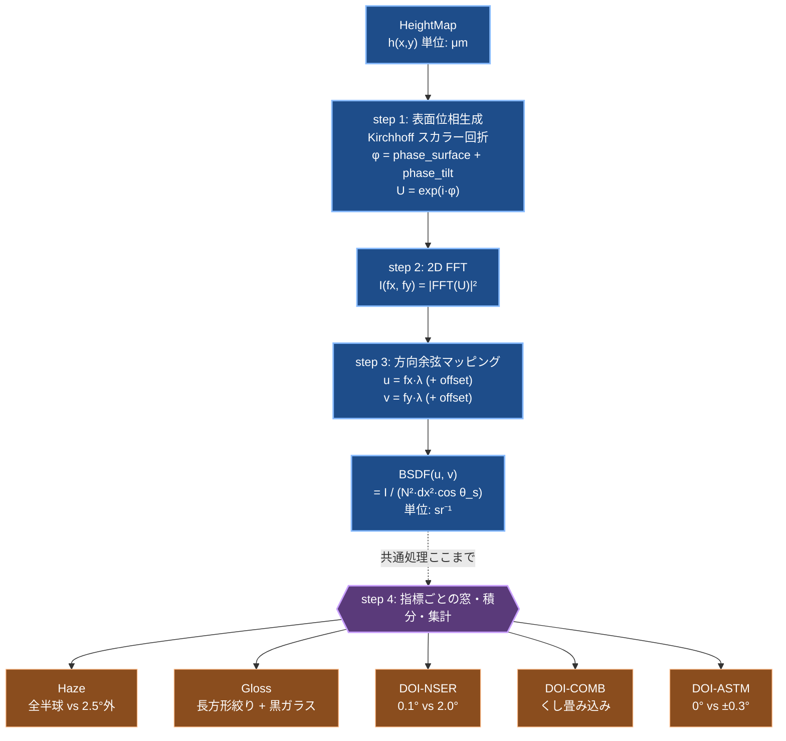
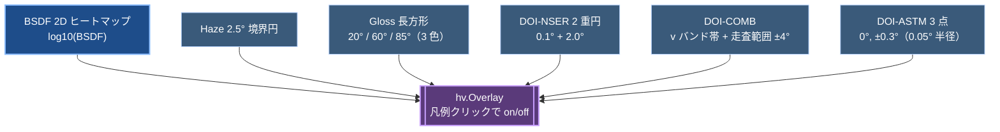
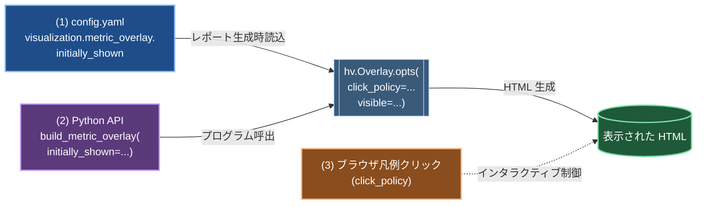
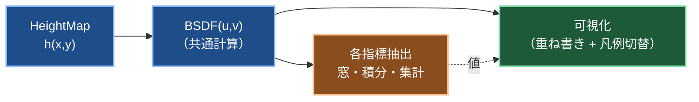

# 光学指標と BSDF の関係 / BSDF グラフ上での可視化提案

本ドキュメントは、Haze / Gloss / DOI（写像性）の 3 指標が FFT BSDF をどう利用するか、
どこまでが共通処理でどこから指標ごとに分岐するかを整理し、その上で **BSDF グラフ上で
各指標の物理的意味を可視化する方法**を提案する。

関連 spec: `spec_main.md` Section 5（評価指標）, Section 3.2（FFT 法）, `docs/fft_bsdf_math.md`（FFT 数式）

---

## 1. 共通パイプライン



**共通要素（どの指標も同じ）:**
- 表面モデル → `HeightMap` 生成
- `compute_bsdf_fft()` による BSDF(u, v) 配列
- (u, v) = 方向余弦空間（$u=\sin\theta_s\cos\phi_s$, $v=\sin\theta_s\sin\phi_s$）
- 立体角要素 $d\Omega = \cos\theta_s \, du \, dv$（積分時に $\cos\theta_s$ 重み付け）
- スペキュラー中心の決定:
  - BRDF: $(u_c, v_c) = (\sin\theta_i, 0)$
  - BTDF: $(u_c, v_c) = (\sin\theta_t, 0)$（Snell で屈折）
- 代表波長 1 つ（`metrics.representative_wavelength_um`、デフォルト 555 nm）

**分岐する要素（指標ごとに異なる）:**

| 要素 | Haze | Gloss | DOI-NSER | DOI-COMB | DOI-ASTM |
|---|---|---|---|---|---|
| 規格 mode | BTDF | BRDF | BTDF | BTDF/BRDF | BRDF |
| 規格 θ_i [°] | 0 | 20/60/85 | 0 | 0 | 20/30 |
| 積分窓の形 | 円（2 個）| 長方形 | 円（2 個）| 矩形波（畳込み）| 円（複数点）|
| 正規化 | 全透過光 | 黒ガラス（オプション）| 小角 halo | 最大/最小比 | 中心値 |
| 値域 | 0〜1 | 0〜1（or 0〜100 GU）| 0〜1 | 0〜1 | 0〜1 |

---

## 2. 各指標の BSDF からの算出

### 2.1 Haze（JIS K 7136 / ISO 14782 / ASTM D1003）

**物理解釈**: 直進光方向（θ_i=0 → u=v=0）から 2.5° 以上散乱した透過光の割合。

$$\text{Haze} = \frac{\iint_{r > r_{2.5}} \text{BSDF}(u,v) \cos\theta_s \, du \, dv}{\iint_{\text{hemisphere}} \text{BSDF}(u,v) \cos\theta_s \, du \, dv}$$

- 分子: 直進光中心から半径 $r_{2.5} = \sin(2.5^\circ) \approx 0.0436$ **以遠**の積分（散乱光）
- 分母: 可視半球全域の積分（全透過光）
- 窓中心: $(u_c, v_c) = (0, 0)$（規格条件は法線入射 BTDF）

実装: `compute_haze()` in `src/bsdf_sim/metrics/optical.py:46-95`

### 2.2 Gloss（JIS Z 8741 / ISO 2813 / ASTM D523）

**物理解釈**: 正反射方向を中心とする **規格長方形絞り**内の積分フラックスを、
黒ガラス（n=1.567）基準で正規化した光沢値。

$$\text{GU} = 100 \times \frac{\iint_{\text{rect}} \text{BSDF}(u,v) \cos\theta_s \, du \, dv}{R_{\text{BG}}(\theta_i)}$$

- 規格長方形絞り（ISO 2813）:
  - 20°: 1.8° (in-plane) × 3.6° (cross-plane)
  - 60°: 4.4° × 11.7°
  - 85°: 4.0° × 6.0°
- (u, v) への変換: $du_{\text{half}} = \cos\theta_i \cdot \Delta_{\text{in}} / 2$, $dv_{\text{half}} = \Delta_{\text{cross}} / 2$
- 窓中心: $(u_c, v_c) = (\sin\theta_i, 0)$
- 黒ガラス基準化がオフ時は分母 1（積分フラックス直出力）

実装: `compute_gloss()` in `src/bsdf_sim/metrics/optical.py:106-207`

### 2.3 DOI-NSER（Near-Specular Energy Ratio、独自・規格非準拠）

**物理解釈**: 直進光コーン（0.1° 半角）と小角散乱コーン（2.0° 半角）のエネルギー比。

$$\text{DOI}_{\text{NSER}} = \frac{\iint_{r \le r_{0.1}} \text{BSDF} \cos\theta_s \, du \, dv}{\iint_{r \le r_{2.0}} \text{BSDF} \cos\theta_s \, du \, dv}$$

- 2 つの同心円内で積分、その比
- 窓中心: $(u_c, v_c) = (0, 0)$（規格条件は法線入射 BTDF）

実装: `compute_doi_nser()` in `src/bsdf_sim/metrics/optical.py:158-232`

### 2.4 DOI-COMB（JIS K 7374、くしば方式）

**物理解釈**: BSDF から 1D 角度プロファイル P(u) を抽出し、5 種のくし幅
(0.125, 0.25, 0.5, 1.0, 2.0 mm) に対応する矩形波を走査して得るコントラスト
$M(d) = (I_{\max} - I_{\min}) / (I_{\max} + I_{\min})$ の平均。

手順:

1. v 軸の中心バンド（$|v - v_c| \le \sin(0.2^\circ)$）で BSDF を平均して P(u) を得る
2. 各くし幅 $d$ と試料〜くし距離 $L = 280$ mm から角度周期 $T(d) = 2d / L$ を計算
3. 32 位相でくしを走査: $I(x) = \sum_{u \in \text{bright}} P(u) \, du$
4. $M(d) = (I_{\max} - I_{\min}) / (I_{\max} + I_{\min})$
5. $\text{DOI}_{\text{COMB}} = \frac{1}{5} \sum_d M(d)$

- 窓中心: $(u_c, v_c) = (0, 0)$ で BTDF、または $(\sin\theta_i, 0)$ で BRDF

実装: `compute_doi_comb()` in `src/bsdf_sim/metrics/optical.py:235-319`

### 2.5 DOI-ASTM（ASTM E430 Dorigon）

**物理解釈**: スペキュラー方向と 0.3° オフセット方向の反射率差分比。

$$\text{DOI}_{\text{ASTM}} = \max\left(0, \frac{R(0) - R(\alpha_{\text{off}})}{R(0)}\right)$$

- $R(\theta)$: 半角 0.05° の円絞り内の $\text{BSDF} \cdot \cos\theta$ 積分値
- オフセットは ±u 両方向の平均
- 窓中心: $(u_c, v_c) = (\sin\theta_i, 0)$（規格 20° or 30° BRDF）

実装: `compute_doi_astm()` in `src/bsdf_sim/metrics/optical.py:322-381`

---

## 3. 共通要素の同一コード抽出マップ

`src/bsdf_sim/metrics/optical.py` 内で共通ヘルパーとして抽出済み:

| ヘルパー | 処理 | 使用指標 |
|---|---|---|
| `_bsdf_grid_geometry(u, v)` | (valid, cos_s, du, dv) を返す共通前処理 | 全絞り系 |
| `_flux_hemisphere(u, v, bsdf)` | 半球全域の積分（全透過光フラックス）| Haze 分母 |
| `_flux_in_circle(u, v, bsdf, u_c, v_c, half_deg, inverted=False)` | 円絞りの内/外の積分 | Haze・DOI-NSER（2 個）・DOI-ASTM（3 個）|
| `_flux_in_rect(u, v, bsdf, u_c, v_c, du_half, dv_half)` | 長方形絞り内の積分 | Gloss |
| `_specular_u_center(theta, mode, n1, n2)` | スペキュラー u 座標（BRDF/BTDF 切替）| 全指標の窓中心決定 |
| `_fresnel_reflectance_unpol(theta, n1, n2)` | 無偏光フレネル反射率（黒ガラス基準化用） | Gloss GU 正規化 |

各指標関数（`compute_haze` / `compute_gloss` / `compute_doi_nser` / `compute_doi_astm`）は
**ヘルパーの呼び出しと比率計算だけ**で構成され、30 行以下に短縮された。
COMB のみ 1D プロファイル抽出 + 矩形波畳み込みという別構造のため共通化対象外。

---

## 4. BSDF グラフ上での指標可視化 — 提案

**目的**: 各指標が「BSDF のどの部分を評価しているか」を一目で確認できるようにする。
ユーザが「Haze = 0.15 って何を積分した結果？」という問いを可視化で解決する。

### 4.1 基本方針

BSDF の 2D ヒートマップ（既存 `save_bsdf_2d_png` / `plot_bsdf_heatmap`）に、
**指標の積分領域を色付き幾何要素でオーバーレイ**する。
1D 角度プロファイル（既存 `plot_bsdf_1d_overlay`）には **マーカー・縦線・アノテーション**で重ねる。

### 4.2 2D ヒートマップへのオーバーレイ（重ね書き）

**採用方針**: 1 枚の 2D ヒートマップに**全指標の積分領域を重ね書きする**（単一図での全体把握を優先）。
タブ分割やサブプロットで分離する案は、混雑時のオプションとして残す（4.5 節参照）。

対象グラフ: log10(BSDF) の 2D イメージ（x = θ_s·cos φ_s, y = θ_s·sin φ_s、または u, v 直接）。

**各指標の描画要素**:

| 指標 | 描画要素 | スタイル例 | 凡例 label |
|---|---|---|---|
| **Haze** | 2.5° 半径の**円**（散乱境界） | 白点線 line_width=2 | `Haze 2.5°` |
| **Gloss 20°** | スペキュラー位置の**長方形**（1.8°×3.6°）| cyan 実線 | `Gloss 20°` |
| **Gloss 60°** | 長方形（4.4°×11.7°）| yellow 実線 | `Gloss 60°` |
| **Gloss 85°** | 長方形（4.0°×6.0°）| magenta 実線 | `Gloss 85°` |
| **DOI-NSER 内** | 0.1° 半径の**円**（直進光） | 青実線 | `DOI-NSER inner 0.1°` |
| **DOI-NSER 外** | 2.0° 半径の**円**（ハロー） | 青破線 | `DOI-NSER outer 2.0°` |
| **DOI-COMB** | v 軸バンド帯 + 走査範囲 ±4° 枠 | 緑ハッチ | `DOI-COMB band ±0.2° / scan ±4°` |
| **DOI-ASTM 中心** | スペキュラー位置の**小円**（0.05°）| 赤実線 | `DOI-ASTM R(0)` |
| **DOI-ASTM 側方** | ±0.3° 位置の**小円**（0.05°）| 赤破線 | `DOI-ASTM R(±0.3°)` |

重ね書きでも識別しやすいように、色・線種・凡例で系統的に区別する（指標ごとに基本色を固定）。

#### オーバーレイ構造（イメージ）



### 4.2.1 インタラクティブ凡例での表示/非表示切替

HoloViews + Bokeh 構成では、**凡例クリックで表示/非表示を切り替える機能が使える**（Bokeh の `click_policy`）。これを有効にすれば、重ね書きで混雑しても必要な指標だけをクリックで残せる。

#### 表示/非表示を設定する 3 つのレイヤー

| レイヤー | 設定場所 | 何を制御するか | 対象 |
|---|---|---|---|
| **(1) config.yaml** | `visualization.metric_overlay` | ユーザが config で恒久的に指定 | 全プロット、全 run |
| **(2) 生成時 API 引数** | `build_metric_overlay(...)` の keyword | プログラムから 1 プロットだけ切替 | 個別呼び出し |
| **(3) ランタイム凡例クリック** | ブラウザで凡例をクリック | 表示後にインタラクティブに切替 | 開いた HTML 1 枚のみ |



**読み方**: 実行前 (1) config と (2) API で初期表示を決め、HTML 生成後は (3) 凡例クリックで動的に切り替える（点線矢印）。

**提案する config.yaml 追加箇所**（新セクション）:

```yaml
# ── 可視化設定 ───────────────────────────────────────────────────────────────
visualization:
  metric_overlay:
    enabled: true                   # 指標領域の重ね書き機能自体の on/off
    click_policy: 'hide'            # 'hide' / 'mute' / 'none'
                                    # hide: クリックで完全非表示（推奨）
                                    # mute: クリックで薄く表示（比較用）
                                    # none: クリック無効（静的表示のみ）
    initially_shown:                # 初期表示する指標（空なら全表示）
      - haze
      - gloss_60
      - doi_nser
      - doi_astm_20
    # 個別色・線種のカスタマイズ（オプション）:
    styles:
      haze:       {color: 'white',   line_dash: 'dashed'}
      gloss_20:   {color: 'cyan',    line_dash: 'solid'}
      gloss_60:   {color: 'yellow',  line_dash: 'solid'}
      gloss_85:   {color: 'magenta', line_dash: 'solid'}
      doi_nser:   {color: 'blue',    line_dash: 'solid'}
      doi_comb:   {color: 'green',   line_dash: 'dotted'}
      doi_astm:   {color: 'red',     line_dash: 'dashed'}
```

**API での設定（Python から）**:

```python
from bsdf_sim.visualization.metric_overlays import build_metric_overlay

overlay = build_metric_overlay(
    bsdf_heatmap,
    u_c=0.0, v_c=0.0,
    theta_i_deg=0.0, mode="BTDF",
    metrics_config=cfg.metrics,          # どの指標が有効か
    click_policy='hide',                  # 凡例クリック動作
    initially_shown=['haze', 'doi_nser'], # 初期表示リスト
)
```

**ランタイム（ブラウザ）での操作**:

1. ブラウザで HTML を開くと、`initially_shown` に指定した系列だけが表示されている
2. 凡例の系列名をクリック → `click_policy='hide'` ならトグル表示/非表示
3. 複数クリックで必要な指標だけを重ねて観察

#### HoloViews 実装詳細

```python
overlay = heatmap * haze_circle * gloss_60_rect * doi_nser_inner * ...

# 初期表示制御（非表示にしたい要素は visible=False を付ける）
if "haze" not in initially_shown:
    haze_circle = haze_circle.opts(visible=False)

overlay.opts(
    click_policy='hide',   # 'hide' / 'mute' / 'none'
    legend_position='right',
    show_legend=True,
)
```

| オプション値 | 挙動 |
|---|---|
| `'hide'` | 選択した系列を完全に隠す（推奨、クリーンに絞り込める） |
| `'mute'` | 薄く（alpha 低下）残す（他との相対比較をしたいとき） |
| `'none'` | クリック無効（デフォルト、静的表示） |

**Panel ダッシュボード（`bsdf dashboard`）**: `dynamicmap.py` の 2D ヒートマップ生成時に
overlay を渡し、上記 opts を適用するだけで凡例クリック機能が有効になる。

**静的出力時の注意**:
- `save_bsdf_2d_png`（matplotlib 経由）ではクリック不可 → `initially_shown` で静的に取捨選択
- `bsdf_report.html`（Bokeh 経由）ではクリック可 → `click_policy` がそのまま動作

**疑似コード（holoviews）**:

```python
def build_metric_overlay(bsdf_heatmap, u_c, v_c, theta_i_deg, metrics_cfg):
    """BSDF ヒートマップに config で有効な指標の積分領域を全て重ねる。"""
    layers = [bsdf_heatmap]
    if metrics_cfg.get("haze", {}).get("enabled"):
        r = np.sin(np.deg2rad(2.5))
        layers.append(
            hv.Ellipse(u_c, v_c, 2*r, label="Haze 2.5°").opts(
                color="white", line_dash="dashed", line_width=2,
            )
        )
    for ang in metrics_cfg.get("gloss", {}).get("enabled_angles", []):
        ap = _GLOSS_APERTURES_DEG[ang]
        du = np.cos(np.deg2rad(ang)) * np.deg2rad(ap["in_plane_deg"]/2)
        dv = np.deg2rad(ap["cross_plane_deg"]/2)
        u_s = np.sin(np.deg2rad(ang))
        color = {"20": "cyan", "60": "yellow", "85": "magenta"}[str(ang)]
        layers.append(
            hv.Rectangles([(u_s-du, -dv, u_s+du, dv)], label=f"Gloss {ang}°").opts(
                fill_alpha=0, line_color=color, line_width=2,
            )
        )
    # ... DOI NSER/COMB/ASTM 同様
    overlay = hv.Overlay(layers)
    return overlay.opts(
        click_policy='hide',
        legend_position='right',
        show_legend=True,
    )
```

### 4.3 1D 角度プロファイルへのマーカー

対象グラフ: $\log_{10}\text{BSDF}$ vs $\theta_s$（既存 `plot_bsdf_1d_overlay`）

**各指標の描画要素**:

| 指標 | 描画要素 |
|---|---|
| **Haze** | θ_s=2.5° 位置に縦破線（境界）、右側領域を薄塗り（散乱部分） |
| **Gloss** | θ_s=20/60/85° 位置にスペキュラーマーカー + 絞り幅を左右の縦線ペアで表示 |
| **DOI-NSER** | 0.1° と 2.0° 位置に縦破線、間を薄塗り |
| **DOI-COMB** | 5 くし幅に対応する角度周期を短い水平バーで示す（y 軸は共通の装飾行） |
| **DOI-ASTM** | 0° と ±0.3° に点マーカー、絞り 0.05° 半径の小円 |

**凡例の工夫**: 各指標の値（例: "Haze = 0.142"）をマーカー付近に直接書き込む、
または凡例内に `Haze (0.142): 2.5° boundary` と値込みで表示。

### 4.4 実装提案

新モジュール `src/bsdf_sim/visualization/metric_overlays.py` を追加:

```python
# API 案
def overlay_haze_2d(heatmap, u_c=0, v_c=0, half_angle_deg=2.5) -> hv.Overlay: ...
def overlay_gloss_2d(heatmap, gloss_angle_deg, u_c, v_c, ...) -> hv.Overlay: ...
def overlay_doi_nser_2d(heatmap, u_c=0, v_c=0, direct=0.1, halo=2.0) -> hv.Overlay: ...
def overlay_doi_astm_2d(heatmap, u_c, v_c, offset_deg=0.3, ...) -> hv.Overlay: ...

def overlay_all_metrics_2d(heatmap, metrics_config, theta_i_deg, mode) -> hv.Overlay:
    """config の有効指標を全部重ねる。"""
```

ダッシュボード / レポート側から:
```python
overlay = overlay_all_metrics_2d(bsdf_2d, cfg.metrics, theta_i, mode)
```

**後方互換**: 既存の 2D/1D プロット関数はそのままに、ラッパー関数として追加するのが安全。
`show_metric_overlay: true` のような config フラグで on/off 制御。

### 4.5 ユースケース別の見せ方

基本は **重ね書き + 凡例クリックで絞り込み**（4.2.1）を採用。混雑を強く避けたい
ユースケースでは以下のオプション:

| ユースケース | 推奨 | 備考 |
|---|---|---|
| **デバッグ**（「なぜこの Haze?」）| 重ね書き + legend click `hide` | 全体把握 → クリックで絞り込み |
| **最適化モニタ**（Optuna dashboard）| 重ね書き + `mute` | 主要指標だけ色濃く表示 |
| **報告書**（PDF/HTML レポート）| 重ね書き（静的）| Bokeh HTML なら click 可、PNG は固定レイアウト |
| **プレゼン用図版**（1 指標だけ見せる）| 指標別タブまたは`show_metric: [haze]` 制限 | 混雑排除オプション |
| **実測比較**（Log-RMSE 検証）| 1D プロファイル + Haze/DOI マーカー | 4.3 節参照 |

### 4.6 実装優先度

最小構成（Phase 1、約 2 時間）:
- [ ] `overlay_haze_2d`, `overlay_gloss_2d`, `overlay_doi_nser_2d`
- [ ] 1D プロファイルへの Haze 2.5° 境界線追加

段階拡張（Phase 2、約 3 時間）:
- [ ] COMB の v バンド / 走査範囲 / くし周期バー
- [ ] ASTM の 3 点マーカー
- [ ] `overlay_all_metrics_2d` 統合関数
- [ ] config フラグ `metrics.show_overlay` 対応

テスト拡張（Phase 3、約 1 時間）:
- [ ] 各 overlay の描画テスト（HoloViews 要素の存在チェック）
- [ ] サンプルプロット生成スクリプト `outputs/_demo_metric_overlays.py`

---

## 5. まとめ



- **共通パイプライン**: HeightMap → 位相 → FFT → BSDF(u, v) は全指標共通。指標ごとの分岐は最後の「窓・積分・集計」のみ（Section 1）。
- **共通ヘルパー実装済み**: `_bsdf_grid_geometry` / `_flux_hemisphere` / `_flux_in_circle` / `_flux_in_rect` で 4 指標の絞り計算を共通化（Section 3）。COMB は別構造のため対象外。
- **可視化戦略**: 重ね書き + 凡例クリックで表示/非表示を切り替え（Section 4.2）。設定は config.yaml / API / ランタイム の 3 層（Section 4.2.1）。

実装に入る場合は、まず **Phase 1（最小構成）**（Section 4.6）から着手し、ダッシュボード・レポート両方で効果を確認してから Phase 2 以降に進むのが安全。
